# smart-timelapse-pipeline

Daily timelapse, from sunrise to sunset, uploaded to YouTube, automatically.

Python, C++, RSync, CRON.

[Youtube](https://www.youtube.com/@RoihuCam)

## Introduciton

This project started as trying to make use of equipment I already owned for something that wasn't totally silly. I can take pictures, I can compute,  I can network, I don't have time and I want to practice using C++. Here was the itital plan:

```mermaid
graph LR
    A[📷 Take pictures] --> B[🎬 Make timelapse] --> C[📺 Upload to YouTube]
```

Initial tests were on a Pi5 were a breeze, but it didn't look very sleek. I had a Pi Zero with a sweet case I bought a few years ago - so no brainer.

Going from cores with GHZs and GBs of RAM to 1 core, 1GHZ and 0.5 GB RAM was interesting! It pushed me to learn about distributing ths system - take images on the Pi0, move them somewhere else to process? However, I had faith in this device and wanted to see it make its mark on the world/YouTube and introduced logging and found it could compile a 30 second video in about 15 minutes with the CPU temp rising only 5c in that time.

Over the weeks, as different challenges surfaced, I found that my initial three parts were becoming more mature. Using log and config files I could decouple each part for better trouble shooting and the algorythms for uploading, backing up and deleting old files could be tweeked for reliability, for example if there was no internet or security credentials were expired.

## What problem am I trying to solve?
- Automatically generate 'content'.
- Photography might be the recording of light. We can use automation to take pictures where there is light - from sunrise to sunset.
- Creating long term observation with 'fire and forget'.
- Use [Raspberry Pi Zero W](https://www.raspberrypi.com/products/raspberry-pi-zero-w/) with it's limited resources - single core, 1ghz, 500mb ram.

## How does it work?

### 📅 Scheduler (scheduler.py)

```mermaid
graph TD
    A[🌍 Read local coordinates from conf] --> B[🌅 Get sunrise/sunset times from API]
    B --> C[🕐 Check for DST]
    C --> D[🌆 Add twilight buffer from conf]
    D --> E[🧮 Calculate interval between pictures]
    E --> F[📝 Write schedule file]
```

### 📷 Timelapse Capture (timelapse.cpp)

```mermaid
graph TD
    A[📄 Read camera settings from conf] --> B[📅 Read schedule for timings]
    B --> C[📷 Start taking pictures]
    C --> D[⏹️ Stop taking pictures]
    D --> E[🎬 Compile into video]
    E --> F[📊 Log start time, end time & CPU temps]
```

### 🏠 Housekeeping (manager.py)

```mermaid
graph TD
    A[💾 Backup files to NAS] --> B[📺 Upload video to YouTube]
    B --> C{💽 Disk space low?}
    C -->|Yes| D[🗑️ Delete picture files]
    D --> E{💽 Still low?}
    E -->|Yes| F[🗑️ Delete oldest video files]
    E -->|No| G[✅ Done]
    C -->|No| G
```

**Configuration:** `timelapse.conf` holds all settings
**Build:** `Makefile` compiles C++ and sets up CRON jobs
**Automation:** CRON jobs trigger each component

 
## How things should work
- fire and forget
- if device looses internet, it will keep going, first deleting pics, then videos.
- keep device 20% empty
- handle Daylight Saving Time (DST)
- handle midsummer and winter - what are the those times going to be, do we have time to processes in 'night time'?

## Features
- We can use .conf file to say which instruction to use for the R-Pi camera on newer Pis.
- Device will first of all delete pictures before deleting videos.

## Improvements
- The settings of the 'take image' take command can be edited.
- conf file?

## Libraries and tools
[configparser](https://docs.python.org/3/library/configparser.html)
This is a really handy library to parse config files - letting me set variables externally of programs.

[logging](https://docs.python.org/3/library/logging.html)
Another handy library that makes nice logfiles.

[cron](https://en.wikipedia.org/wiki/Cron)
Scheduluer built into the system.

[rsync](https://en.wikipedia.org/wiki/Rsync)
We have CP to copy a file, SCP to copy over network and Rsync expands on those capabilities.

[sshpass](https://sshpass.com/)
I had issues with key-based access to my NAS and this provides a workaround by locally storing a password.

[rpicam-still](https://www.raspberrypi.com/documentation/computers/camera_software.html#rpicam-apps)
Raspberry Pi camera library. 

## Logs
- CPU temp during video compilation
- Time to compile video

## Backups
To stop the memory card clogging up, we send files to a NAS for backup.

- Clear files to NAS daily, into a directory with [Device_ID] (defined in .conf).
- Folder with YYYYMMDD-[Device_ID]-timelaps_pics for the pics
- File with YYYYMMDD-[Device_ID]-timelapse.mp4 for the video
- Upload to Youtube.
- Delete after 4 days (defined in .conf)

## Health check

- How do we know everything is okay?
- Could we send 'critical' logs?

## Backlog

I have many projects I want to build. Some features I would like to explore:

- use execvp() instead of std::system.
- text overlay with opencv.
- remove files, regardless of backup, when disk space is at X
- - perhaps remove images first, until diskspace < 60%, and then remove oldest video.
