# smart-timelapse-pipeline

Daily timelapse, from sunrise to sunset, uploaded to YouTube, automatically.

Python, C++, RSync, CRON.

[YouTube](https://www.youtube.com/@RoihuCam)

## Introduction

This project started as trying to make use of equipment I already owned for something that wasn't totally silly. I can take pictures, I can compute, I can network, I don't have time and I want to practice using C++. Here was the initial plan:

Initial tests on a Pi5 were a breeze, but it didn't look very sleek. I had a Pi Zero with a sweet case I bought a few years ago - so no brainer.

Going from cores with GHZs and GBs of RAM to 1 core, 1GHZ and 0.5 GB RAM was interesting! It pushed me to learn about distributing the system - take images on the Pi0, move them somewhere else to process? However, I had faith in this device and wanted to see it make its mark on the world/YouTube and introduced logging and found it could compile a 30 second video in about 15 minutes with the CPU temp rising only 5c in that time.

Over the weeks, as different challenges surfaced, I found that my initial three parts were becoming more mature. Using log and config files I could decouple each part for better troubleshooting and the algorithms for uploading, backing up and deleting old files could be tweaked for reliability, for example if there was no internet or security credentials were expired.

## What problem am I trying to solve?

- Automatically generate 'content'.
- Photography might be the recording of light. We can use automation to take pictures where there is light - from sunrise to sunset.
- Creating long term observation with 'fire and forget'.
- Use [Raspberry Pi Zero W](https://www.raspberrypi.com/products/raspberry-pi-zero-w/) with its limited resources - single core, 1ghz, 500mb ram.
- Handle Daylight Saving Time and seasonal variation (midsummer vs winter daylight hours).

## How does it work?

### 📅 Scheduler (scheduler.py)

```mermaid
graph TD
    A[🌍 Read local coordinates from conf] --> B[🌅 Get sunrise/sunset times from API]
    B --> C[🕐 Check for DST]
    C --> D[🌆 Add twilight buffer from conf]
    D --> E[🧮 Calculate interval between pictures]
    E --> F[📝 Write schedule file]
```

### 📷 Timelapse Capture (timelapse.cpp)

```mermaid
graph TD
    A[📄 Read camera settings from conf] --> B[📅 Read schedule for timings]
    B --> C[📷 Start taking pictures]
    C --> D[⏹️ Stop taking pictures]
    D --> E[🎬 Compile into video]
    E --> F[📊 Log start time, end time & CPU temps]
```

### 🏠 Housekeeping (manager.py + disk_cleanup.py)

```mermaid
graph TD
    A[💾 Backup photos & video to NAS] --> B[📺 Upload video to YouTube]
    B --> C[🗑️ Delete old backed-up photos]
    C --> D[🗑️ Delete old backed-up videos]
    D --> E{💽 Disk pressure?}
    E -->|Yes| F[🗑️ Emergency: delete more backed-up items]
    E -->|No| G[✅ Done]
    F --> G
```

Files are only deleted once confirmed backed up to NAS (`.backed_up` marker). Videos also require a `.youtubed` marker if YouTube upload is enabled. If the network goes down and backups stop, nothing gets deleted - the SD card fills up as a forensic record rather than losing unbacked data.

**Configuration:** `timelapse.conf` holds all settings
**Build:** `Makefile` compiles C++ and sets up CRON jobs
**Automation:** CRON jobs trigger each component on schedule

## Observability

The C++ capture binary writes a status file (`/tmp/timelapse_status.json`) on every capture, and a lightweight Python HTTP server (`programs/metrics_server.py`) exposes it as Prometheus metrics at `:8080/metrics`. Zero pip dependencies — Python stdlib only.

Prometheus on a [k3s cluster](https://github.com/jackwaddington/jWorld-observability) scrapes the Pi as a static target every 60 seconds. Metrics include capture progress, photo count, errors, disk usage, CPU temperature, and backup status.

See [pm/03-observability-spec.md](pm/03-observability-spec.md) for the full specification and [pm/04-setup-guide.md](pm/04-setup-guide.md) (Step 9) for deployment instructions.

## Setup

1. Clone to Pi and edit `conf/timelapse.conf` with your coordinates, NAS IP, and camera settings
2. Run `make` to compile the C++ capture program and install CRON jobs
3. For YouTube upload: add `client_secrets.json` to `conf/` and run `python3 programs/youtube_auth.py --headless`
4. For Prometheus metrics: `sudo cp deploy/timelapse-metrics.service /etc/systemd/system/ && sudo systemctl enable --now timelapse-metrics`

## Tools

- [OpenCV](https://opencv.org/) - video compilation from captured frames
- [rpicam-still](https://www.raspberrypi.com/documentation/computers/camera_software.html#rpicam-apps) - Raspberry Pi camera capture
- [rsync](https://en.wikipedia.org/wiki/Rsync) - NAS backup via rsync daemon
- [cron](https://en.wikipedia.org/wiki/Cron) - scheduling
- [configparser](https://docs.python.org/3/library/configparser.html) / [logging](https://docs.python.org/3/library/logging.html) - Python config and log management
